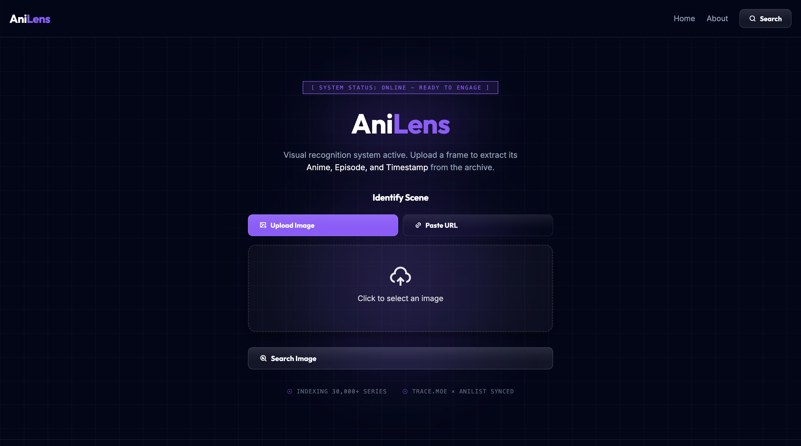
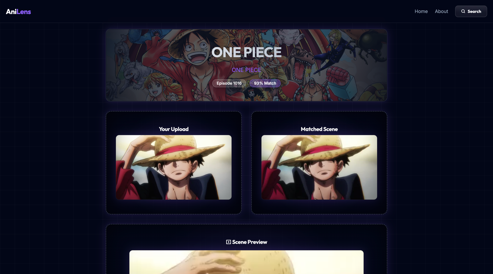
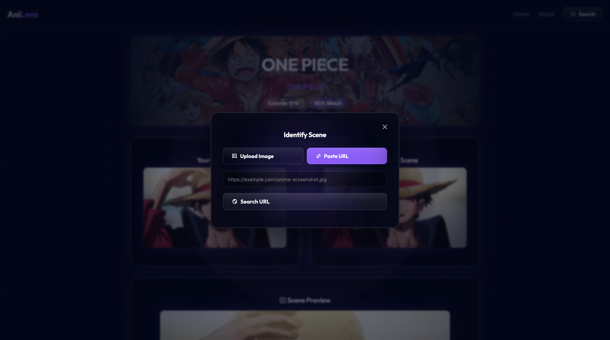

<p align="center">
  
</p>

<p align="center">
  
  
  
  
</p>


# AniLens – Anime Scene Finder

AniLens is a web application that helps identify the anime, episode, and scene from a single screenshot or image URL.

Given an anime frame, AniLens searches for visually similar scenes and presents the most likely match along with relevant metadata, confidence score, and scene previews. The project focuses on clarity, usability, and a comparison-driven interface.

---

## Screenshots

### Home Page


### Result Page


### Search Modal


### Additional UI States

---

## What AniLens Does

AniLens answers a simple question:

**“Which anime is this scene from?”**

Users can upload an anime screenshot or provide an image URL. The application analyzes the image and returns the closest matching anime scene, including the anime title, episode number, similarity confidence, and preview media.

The interface is designed to clearly compare the uploaded image with the detected scene, making results easy to understand at a glance.

---

## How It Works

1. The user uploads an image or pastes an image URL.
2. The image is sent to the **trace.moe** API for scene recognition.
3. The result is enriched with anime metadata using **AniList**.
4. AniLens displays:
   - Anime titles (Romaji and English)
   - Episode information
   - Similarity confidence score
   - Scene preview image and video clip
5. If something goes wrong, a dedicated error page explains the issue clearly.

---

## Key Features

- Anime scene detection directly from screenshots or image URLs, allowing users to search scenes without hosting images online. 
- Clear confidence scoring for result accuracy  
- Scene preview using images and short video clips  
- Responsive UI for desktop and mobile devices  
- Modal-based search for quick re-queries  
- Dedicated error handling and error page  

---

## Tech Stack

- **Node.js**
- **Express.js**
- **EJS** (server-side rendering)
- **Axios** (API requests)
- **Multer** (image uploads)
- **trace.moe API** (scene recognition)
- **AniList API** (anime metadata)

---

## Getting Started (Run Locally)

### Prerequisites
- Node.js (v16 or later recommended)
- npm

### Installation

```bash
git clone https://github.com/Ash-the-k/AniLens-anime-scene-finder.git
cd AniLens-anime-scene-finder
npm install
```

### Run the Application

```bash
node index.js
```

Then open:

```
http://localhost:3000
```

No environment variables are required for basic usage.

---

## Limitations & Known Issues

* Accuracy depends on the quality and uniqueness of the input image.
* Only the top matching result is displayed (trace.moe can return multiple matches).
* Keyboard UX is limited in some cases (for example, pressing Enter does not always trigger a search).
* NSFW content is not filtered at the application level.
* The official trace.moe website may provide a faster experience for URL-based searches and supports multiple result matches.


These limitations are known and documented, and some may be addressed in future iterations.

---

## Credits

- [**trace.moe**](https://trace.moe) – Anime scene recognition API  
  API Documentation: https://soruly.github.io/trace.moe-api/#/  

- [**AniList**](https://anilist.co) – Anime metadata and media  

AniLens is inspired by trace.moe and built on top of its public API, with a focus on image uploads and a comparison-focused user interface.

---


## About the Author

AniLens was built by **Ashlesh** as a capstone project for
[The Complete Web Development Bootcamp](https://www.udemy.com/course/the-complete-web-development-bootcamp/).

The goal of the project was to build a complete, API-driven web application with clean backend architecture, clear data flow, and a user-focused interface.

---

## Future Improvements

* Deployment to a public hosting platform
* Displaying multiple top matches instead of a single result
* Improved keyboard and accessibility support
* Optional result history or bookmarking
